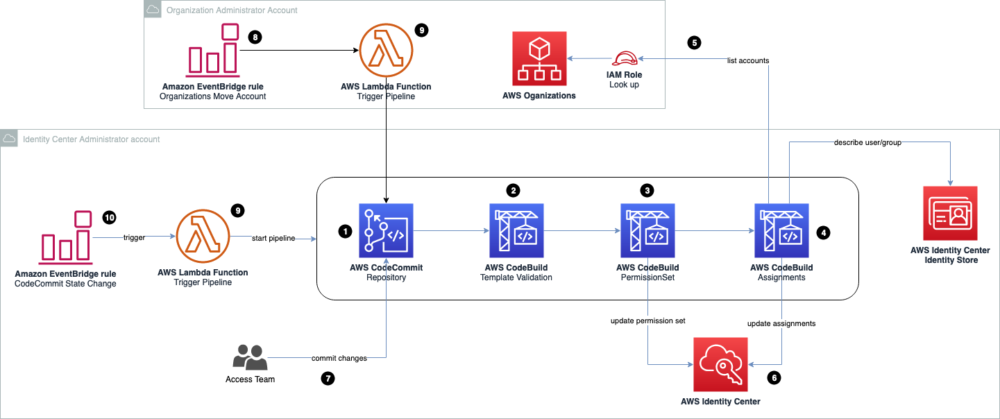

This artifact is published in AWS Prescriptive Guidance. Please look for the most updated info there: https://apg-library.amazonaws.com/content/419aaa80-1b97-402d-9c74-c1b8c1ddd1cb **(it will be updated once APG is public)**

## Summary
AWS IAM Identity Center (successor to AWS Single Sign-On) helps you securely create or connect your workforce identities and manage their access centrally across AWS accounts and applications. IAM Identity Center is the recommended approach for workforce authentication and authorization on AWS for organizations of any size and type. Companies can bring their identities from their Microsoft Active Directory to assign them to AWS accounts with specific permissions. With the AWS Identity Center, you get a unified administration experience to define, customize, and assign fine-grained access.

This pattern helps you to manage AWS IAM Identity Center permission in your multi-account environment as a code. With this pattern, you will be able to achieve the following defined as code:
* Create, delete and update permission sets 
* Create, update or delete assignments from your permission set with your target (AWS accounts or AWS Organization Units) with your federated users from your AWS IAM Identity Center Identity Store (e.g. Microsoft Active Directory)

To manage your AWS IAM Identity Center permissions and assignments as code, this solution will deploy a pipeline with AWS services (AWS CodeCommit, AWS CodeBuild and AWS CodePipeline). The pipeline will be triggered every time someone commits changes to specific files in the repository or any time an AWS account is moved from its AWS Organizational Unit. The triggers are implemented using AWS EventBridge rules based on patterns and a AWS Lambda function.

## Prerequisites
To deploy this solution, ensure you have the following requirements:
* A multi-account environment with AWS Organizations already set up
* Access in the Identity Center delegated administrator account to deploy stacks
* Access in the AWS Management account to deploy stacks
* A S3 bucket in the Identity Center delegated administrator to upload the artifact code
* AWS Organization Management account ID

## Planning your templates
This pipeline will manage AWS IAM Identity Center permissions using JSON templates. These templates are the state of your permission sets and assignments in AWS IAM Identity Center. There are sample templates in the folder 'iam-identitycenter-repository/templates/'. There are two different template types: permission sets and assignments.

### Permission Set Templates
This JSON template is used to manage permission sets. Each file represents a Permission Set in the AWS IAM Identity Center. The following fields of the template must be filled out:
```
{
    "Name": "MyTeamAccess",
    "Description": "My team access in AWS",
    "SessionDuration": "PT4H",
    "ManagedPolicies": [
        "arn:aws:iam::aws:policy/job-function/ViewOnlyAccess"
    ],
    "CustomerManagedPolicies": [
        "myManagedPolicy",
        "anotherMangedPolicy"
    ],
    "PermissionBoundary": {
        "PolicyType": "AWS",
        "Policy": "arn:aws:iam::aws:policy/AdministratorAccess"
    },   
    "CustomPolicy": {
        "Version": "2012-10-17",
        "Statement": [
            {
                "Sid": "ProductionAllowAccess",
                "Effect": "Allow",
                "Action": [
                    "ec2:*",
                ],
                "Resource": "*"
            }
        ]
    }
}
```

* **Name**
    * Type: String
    * Can be changed after deployed: No
    * Description: Name of the permission set in AWS Identity Center. Once deployed, this field cannot be changed and must be unique. 
* **Description**
    * Type: String
    * Can be changed after deployed: Yes
    * Description: Description of the permission set in AWS Identity Center
* **SessionDuration**
    * Type: String
    * Can be changed after deployed: Yes
    * Description: Role session duration in ISO-8601 format
* **ManagedPolicies**
    * Type: List (String)
    * Can be changed after deployed: Yes
    * Description: List of managed policies ARN in the permission set
* **CustomerManagedPolicies**
    * Type: List (String)
    * Can be changed after deployed: Yes
    * Description: Customer Managed policies that will be added to the permission set. It should be the name of the policy, not the ARN
* **PermissionBoundary**
    * Type: String (JSON)
    * Can be changed after deployed: Yes
    * Description: Your permission boundary. PolicyType should be 'AWS' if a AWS managed policy is used as permission boundary and 'Customer' if a Customer Managed Policy is used. The field "Policy" should be the AWS managed policy ARN for AWS managed policy and policy name for Customer Managed Policy.
* **CustomPolicy**
    * Type: String (JSON)
    * Can be changed after deployed: Yes
    * Description: Custom inline policy that will be added to the permission set

> If you are not using any of the fields above, you can specify in the template as empty (e.g.: PermissionBoundary: {} ) or just remove from the template.

### Assignment Templates
This JSON template is used to manage the relationship between Principal vs Accounts vs PermissionSets. The following fields of the template must be filled out:

```
{
    "Assignments": [
        {
            "SID": "Assingment01",
            "Target": [
                "ou-ag00-uv9hvcz2"
            ],
            "PrincipalType": "GROUP",
            "PrincipalId": "LAB-NetworkAdministrator@domain.internal",
            "PermissionSetName": "NetworkAdministrator"
        }
    ]
}
```

* **SID**
    * Type: String
    * Can be changed after deployed: No
    * Description: Assignment identifier. Must be unique and cannot change
* **Target**
    * Type: List (string)
    * Can be changed after deployed: Yes
    * Description: Target where the principal will have access with a specific permission set. Supports AccountIds, Organizational Unit (OU) IDs, Organizational Unit (OU) Names and Root Id or just "Root" (for associating to all accounts) 
* **PrinicipalType**
    * Type: String
    * Can be changed after deployed: No
    * Description: Type of the principal that will get the assignment. Can be GROUP or USER
* **PrinicipalId**
    * Type: String
    * Can be changed after deployed: No
    * Description: Name of the user in the IdentityStore that will get the assignment.

## Getting Started (deploy)
1. Build the JSON templates in the /templates/ folder to reflect the permission you want in your AWS Identity Center.
2. Zip all content of this project (not the folder) and upload in the S3 bucket in the identity center account
3. Deploy the the stack file 'iam-identitycenter-pipeline.yaml' in the identity center account. Read carefully the description of each parameter to fill it out correctly.
4. Deploy the required resources in your Management Account **in the region us-east-1**. You can achived this by deploying the template "iam-identitycenter-organization". 

## Pipeline architecture
The pipeline is triggered in the following conditions:
* **CodeCommit changes**: every time someone commits a new change in CodeCommit, a Lambda will be triggered. The Lambda will ignore changes in files such as README.md or the CloudFormation template.
* **New Account Created**: every time AWS Control Tower creates a new account it will start the pipeline. It monitors the action "MoveAccount" from Organizations API.

### Pipeline stages
* **Source**: Source code stage
* **TemplateValidation**: Validates the templates in the /templates/ folder. The validation includes
    * Custom inline IAM policy JSON syntax
    * Unique SIDs
    * Unique permission set names
    * Valid managed policy ARNs
* **PermissionSet**: Deploy changes in permission set
* **Assignments**: Deploy changes in assignments (principal vs. target vs. permissionSet). It uses Terraform to manage the state.



**The diagram shows the following workflow:**

1. A CodeCommit repository hosts the source code of the AWS IAM Identity Center assignment. It is the first step of the pipeline.
2. An AWS CodeBuild step responsible for validation the templates. It uses a Python script to validate. This step will validate the following:
* If permission sets in the templates have unique names
* If assignments "SID"s are unique
* If the CustomPolicy from permission set templates are valid (this step is made using IAM Access Analyzer)
* If the permission set managed policies ARN are valid
3. An AWS CodeBuild step responsible for deleting, creating or updating permission sets in AWS IAM Identity Center. It uses a Python script with boto3 SDK to manage permission sets. Only permission sets with the tag “SSOPipeline:true” will be affected. Permission sets created by this pipeline will have the same tag.
4. An AWS CodeBuild step responsible for deleting, creating or updating assignments in AWS IAM Identity Center. It uses Terraform to manage assignments. State files are stored in S3 bucket in the same account.
5. During the assignment step, AWS CodeBuild will request AWS Organization and AWS IAM Identity Center Identity Store APIs to list resources required to grant or revoke permissions.
6. Changes (in permission sets and assignments) are made by AWS CodeBuild stages in AWS IAM Identity Center.
7. Security Engineers / Access team will manage permissions using the templates in the repository as code.
8. When an AWS account is moved from its AWS Organizational Unit, an EventBridge rule will trigger an AWS Lambda function, so the pipeline can start. New accounts created will have permission sets assigned to it once they are moved to its AWS Organization Unit.
9. AWS Lambda functions responsible for triggering the pipeline
10. Changes in the repository will trigger the AWS Lambda so it can start the pipeline. Changes in certain files will be ignored (e.g. README.md).

### Automation and Scale
Because all new accounts in a multi-account environment are moved to a specific AWS Organizational Unit, this automation will run and grant the required permission sets to the account that are specified in the assignment templates as code.
Large environments might see a slow down due the amount of API request to AWS Identity Center. Throttling is being managed by Terraform (assignment stage) and boto3 SDK Config (permission set stage).


### File Structure
The  File structure of the AWS Identity Center Pipeline consists of the following:

```
aws-iam-identity-center-pipeline
└── README.md
├── iam-identitycenter-pipeline.yaml                    [ YAML CloudFormation template to deploy the pipeline]
├── iam-identitycenter-organization.yaml                [ YAML CloudFormation template to deploy resources in Management Account]
├── pictures
│   ├── iam-identitycenter.drawio
│   └── iam-identitycenter.png
├── source
│   ├── assignments
│   │   ├── iam-identitycenter-assignments.py           [ python code for resolving OUs in AWS accounts]
│   │   └── iam-identitycenter-assignments.tf           [ terraform code for creating assignments]
│   ├── permissionsets
│   │   └── iam-identitycenter-permissionset.py         [ python code for managing permission set in CodeBuild ]
│   └── validation
│       └── iam-identitycenter-validation.py            [ python code for validating templates repository folder ]             
└── templates
    ├── assignments                                     [ JSON template to manage assignments ]
    │   └── iam-identitycenter-assigments.json
    └── permissionsets                                  [ JSON templates to manage permission sets ]
        ├── DatabaseAdministrator.json
        ├── NetworkAdministrator.json
        ├── OperationEngineer.json
        ├── ProductOwner.json
        ├── ProductionAccess.json
        └── SecurityEngineer.json
```

### Automation and Scale
Because all new accounts in a multi-account environment are moved to a specific AWS Organizational Unit, this automation will run and grant the required permission sets to the account that are specified in the assignment templates as code. Large environments might see a slow down due the amount of API request to AWS Identity Center. Throttling is being managed by Terraform (assignment stage) and boto3 SDK Config (permission set stage).

## Tools
* AWS CloudFormation – AWS CloudFormation helps you automatically set up your AWS resources. It enables you to use a template file to create and delete a collection of resources together as a single unit (a stack).
* AWS Organizations – AWS Organizations is an account management service that enables you to consolidate multiple AWS accounts into an organization that you create and centrally manage. Organizations includes account management and consolidated billing capabilities that enable you to better meet the budgetary, security, and compliance needs of your business.
* Amazon S3 – Amazon Simple Storage Service (Amazon S3) is an object storage service. You can use Amazon S3 to store and retrieve any amount of data at any time, from anywhere on the web.
* AWS CodeCommit - AWS CodeCommit is a secure, highly scalable, managed source control service that hosts private Git repositories.
* AWS CodePipeline - AWS CodePipeline is a fully managed continuous delivery service that helps you automate your release pipelines for fast and reliable application and infrastructure updates. 
* AWS CodeBuild - AWS CodeBuild is a fully managed continuous integration service that compiles source code, runs tests, and produces software packages that are ready to deploy. 
* AWS IAM Identity Center - AWS IAM Identity Center is where you create, or connect, your workforce identities in AWS once and manage access centrally across your AWS organization.


## Best practices
* This pipeline will manage (create, update and delete) only Permission Sets with the tag SSOPipeline:true
* You can have multiple templates in the same folder (both for permission sets and assignments)
* When you exclude a template, the pipeline will exclude the assignment / permission set
* If you exclude an entire assignment JSON block, the pipeline will delete the assignment from AWS IAM Identity Center
* You can't exclude a permission set that is assigned to an AWS account
* You can’t manage a permission set that is associated to the Management Account
* You can’t manage predefined permission sets type
* You can't have multiple permission sets with the same name
* You can't have multiple assignments with the same SID
* If you change the Permission Set name, it will create a new one and delete the oldest

> **IMPORTANT**: When you are using Customer Managed Policies, you need to ensure that the policies are already created in AWS accounts you plan to deploy your permission set. This is the same for using customer managed policies as Permission Boundaries.

## Security

See [CONTRIBUTING](CONTRIBUTING.md#security-issue-notifications) for more information.

## License

This library is licensed under the MIT-0 License. See the LICENSE file.

