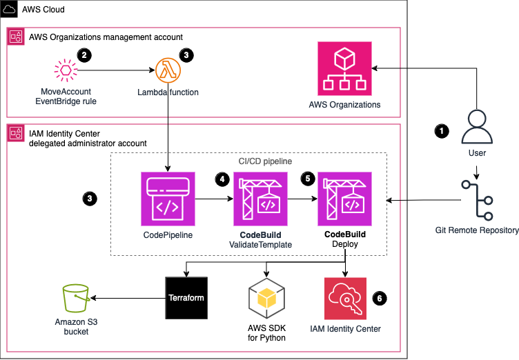

# AWS IAM Identity Center Pipeline

AWS IAM Identity Center (successor to AWS Single Sign-On) helps you securely create or connect your workforce identities and manage their access centrally across AWS accounts and applications. IAM Identity Center is the recommended approach for workforce authentication and authorization on AWS for organizations of any size and type. Companies can bring their identities from their Microsoft Active Directory to assign them to AWS accounts with specific permissions. With the AWS Identity Center, you get a unified administration experience to define, customize, and assign fine-grained access.

This pattern helps you to manage AWS IAM Identity Center permission in your multi-account environment as a code. With this pattern, you will be able to achieve the following defined as code:
* Create, delete and update permission sets 
* Create, update or delete assignments from your permission set with your target (AWS accounts or AWS Organization Units) with your federated users from your AWS IAM Identity Center Identity Store (e.g. Microsoft Active Directory)

To manage your AWS IAM Identity Center permissions and assignments as code, this solution will deploy a pipeline with AWS services (AWS CodeCommit, AWS CodeBuild and AWS CodePipeline). The pipeline will be triggered every time someone commits changes to specific files in the repository or any time an AWS account is moved from its AWS Organizational Unit. The triggers are implemented using AWS EventBridge rules based on patterns and a AWS Lambda function.

The code in this repository helps you set up the following target architecture.

For prerequisites and instructions for using this AWS Prescriptive Guidance pattern, see [Manage AWS IAM Identity Center permission sets as code by using AWS CodePipeline](https://docs.aws.amazon.com/prescriptive-guidance/latest/patterns/manage-aws-iam-identity-center-permission-sets-as-code-by-using-aws-codepipeline.html).
